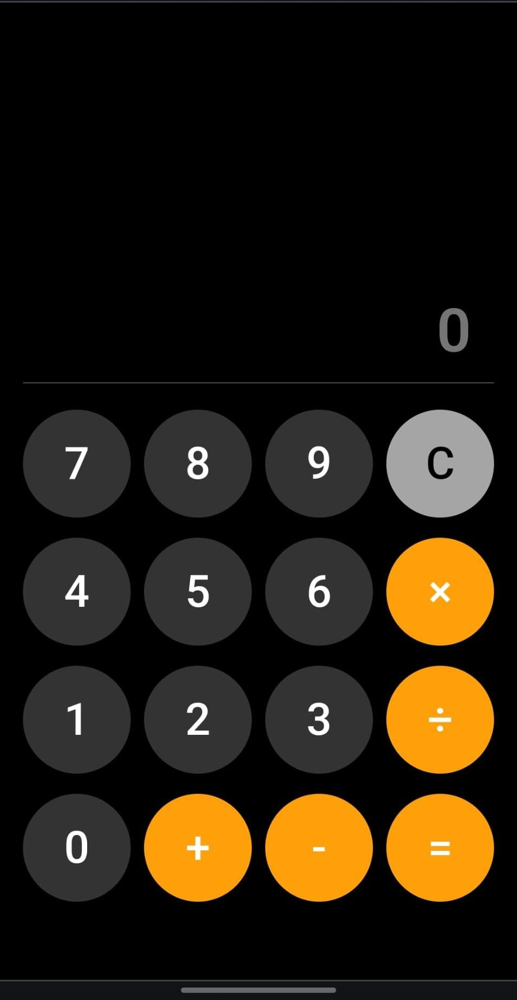

## Simple Calculator
Click [here](https://dupanshu.github.io/simple-calc/) to use tha calc in your device's browser.

### It looks like this
On mobile device (Viewport Width: 384px) in Chrome view.

##
On Firefox


### Mapping the array for buttons
To display the numbers and symbols in your calculator app you can use ma
```JavaScript
// Syntax
// array.map(function(currentValue, index, arr), thisValue)
const numbers = [7, 8, 9, 'C', 4, 5, 6, '×', 1, 2, 3, '÷', 0, '+', '-', '='];

const mappedNumbers = numbers.map(number => {
  const button = utils.create('input');
  button.type = 'button';
  button.value = number;
  return button;
});

mappedNumbers.forEach(button => {
  mapHere.appendChild(button);
});
// mapHere: specific DOM element to which buttons are being appended.
// utils: A utility JavaSript file is used here to handle the general functions and make code more readable and clean.
```

